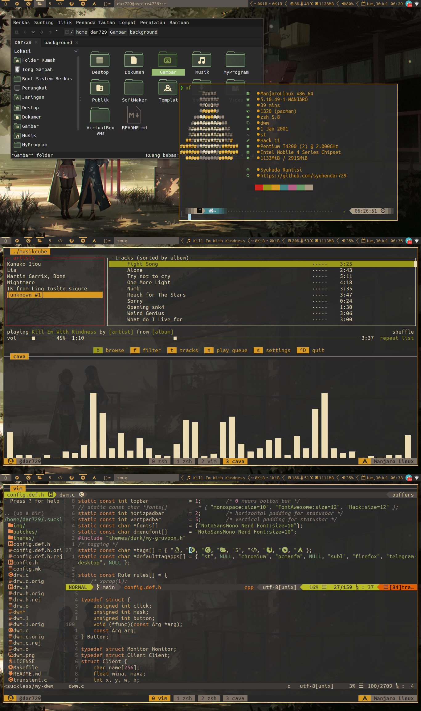
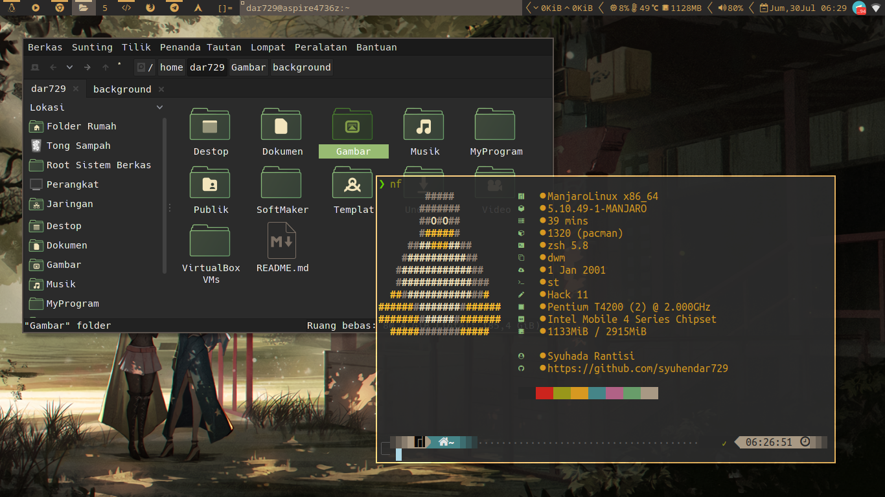
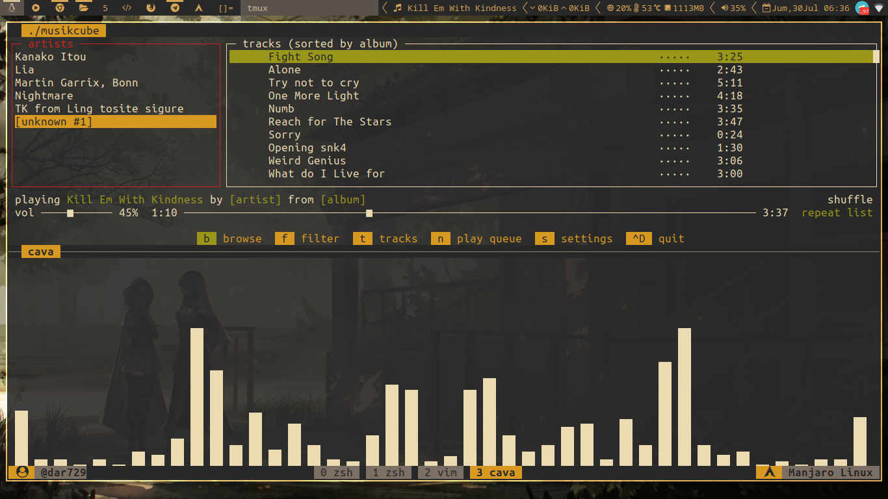
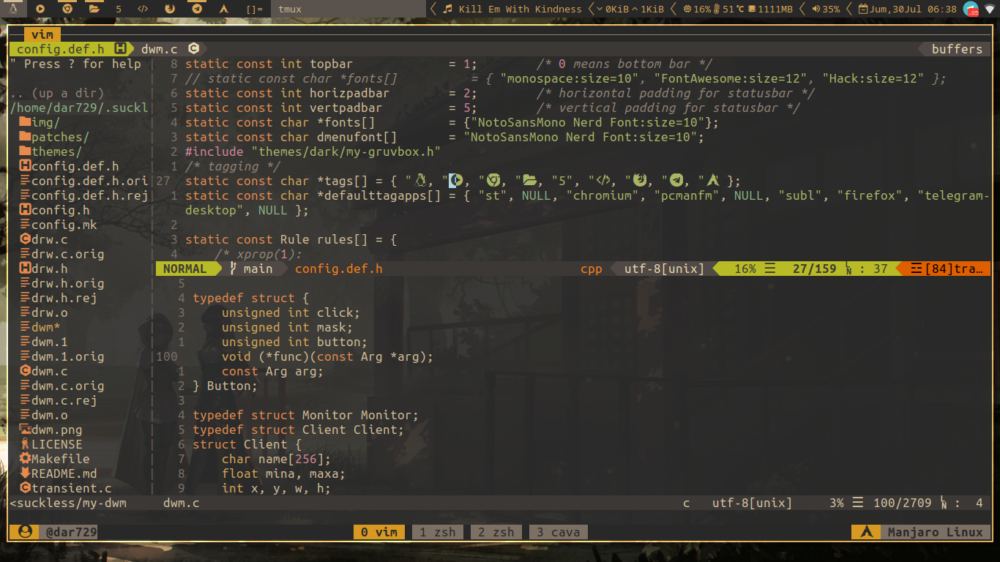

dwm - dynamic window manager
============================

dwm patched
-----------
- fullgaps
- autostart
- only-quit-on-empty
- restartsig
- inditag
- statuspadding
- systray
- default-tag-apps

### Three image

### One image

dwm is an extremely fast, small, and dynamic window manager for X.

Requirements
------------
In order to build dwm you need the Xlib header files.

Installation
------------
Edit config.mk to match your local setup (dwm is installed into
the /usr/local namespace by default).

Afterwards enter the following command to build and install dwm (if
necessary as root):

	make
	make clean install

Running dwm
-----------
Add the following line to your .xinitrc to start dwm using startx:

	exec dwm

In order to connect dwm to a specific display, make sure that
the DISPLAY environment variable is set correctly, e.g.:

	DISPLAY=foo.bar:1 exec dwm

(This will start dwm on display :1 of the host foo.bar.)

In order to display status info in the bar, you can do something
like this in your .xinitrc:

	while xsetroot -name "`date` `uptime | sed 's/.*,//'`"
	do
		sleep 1
	done &
	exec dwm

Running dwm on Display Manager
------------------------------
Create file `dwm.desktop` in `/usr/share/xsessions/` 

Add to `dwm.desktop` :

	[Desktop Entry]
	Encoding=UTF-8
	Name=DWM
	Comment=Dynamic Window Manager
	Exec=dwm
	Icon=
	Type=Application

Logout

On Login Screen select `dwm`

Configuration
-------------
The configuration of dwm is done by creating a custom config.h
and (re)compiling the source code.

