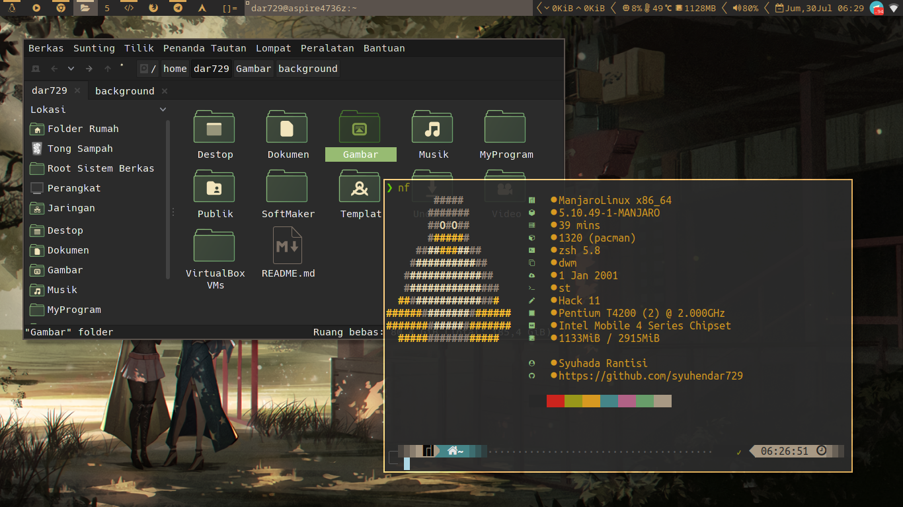
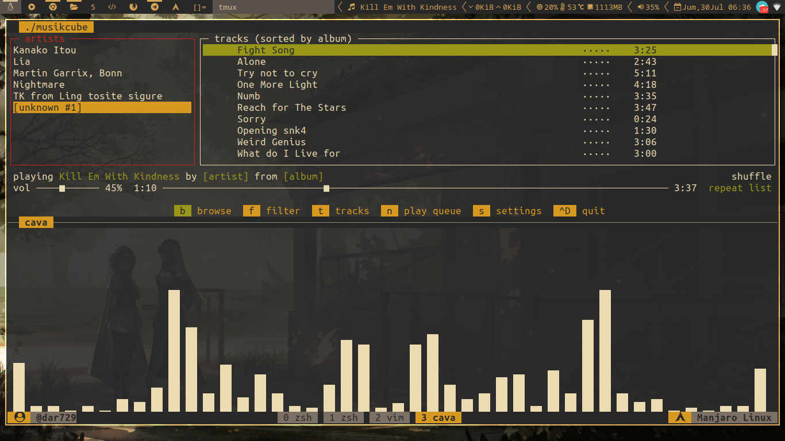
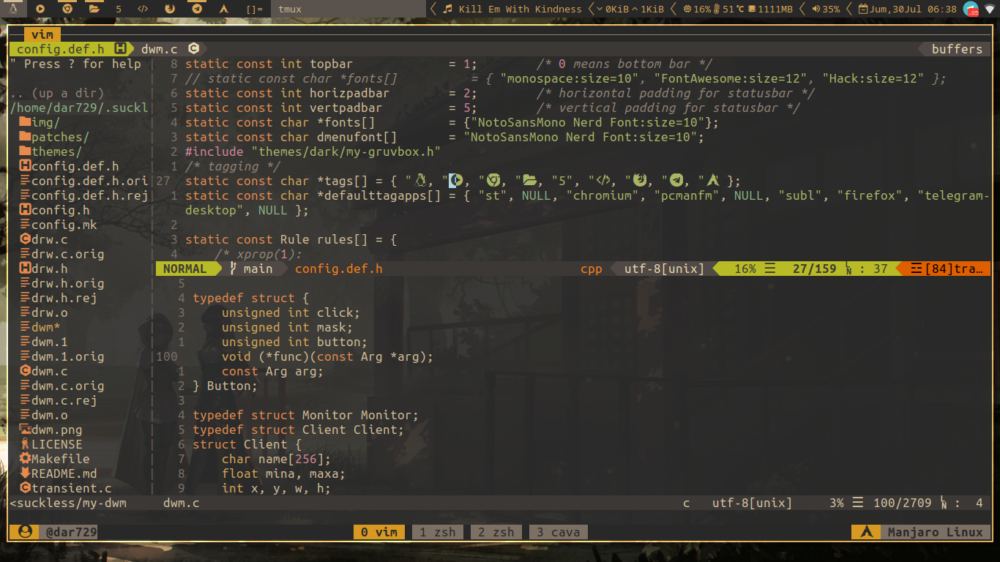

# My Dotfiles






## Install
- clone this repo on your directory
```
git clone https://github.com/syuhendar729/public-dotfiles
```
- create simbolic link on your configuration
```
ln -s /path/to/asal /path/to/tujuan
```
See also [My dwm configuration](https://github.com/syuhendar729/dwm "My dwm configuration").
